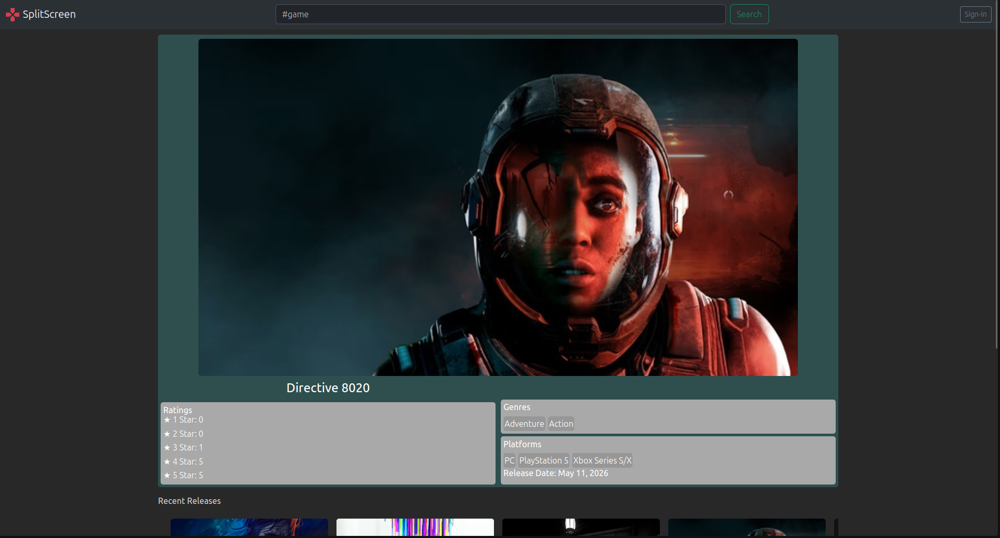
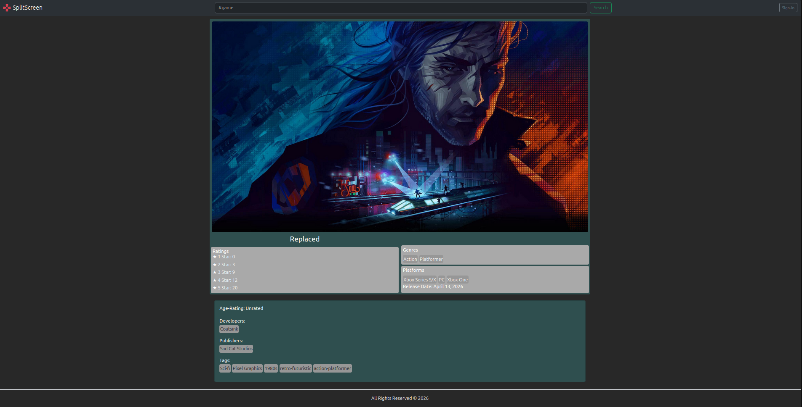
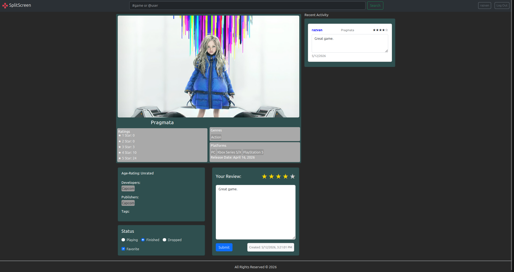

# Splitscreen

Splitscreen is a full-stack social gaming web application for discovering games, sharing reviews, tracking play activity, and managing favorites with friends.

## Screenshots

### Home Page


### Game Page


### Profile Page


## Progress Report
## Overview

The final application is deployed with Docker Compose, using an Express backend, MariaDB database, and Express-based frontend behind an Nginx reverse proxy.

## Key features

- User authentication with JWT sessions
- Game search and details powered by external game data
- Reviews and ratings with per-user history
- Activity tracking for played, playing, and wishlist statuses
- Favorites management and personalized libraries
- Friend system and shared activity feeds
- Progressive Web App support with offline caching and installability

## Setup

1. Copy `Final/.env.template` to `Final/.env` and provide the required values.
2. From the `Final/` directory, run:
   ```bash
   docker compose up --build
   ```
3. Open the application in a browser at `http://localhost`

## Environment variables

Required values in `Final/.env`:

- `MYSQL_ROOT_PASSWORD`
- `MYSQL_DATABASE`
- `MYSQL_USER`
- `MYSQL_PASSWORD`
- `DB_HOST`
- `DB_PORT`
- `PORT`
- `API_SECRET_KEY`
- `RAWG_API_KEY`

## Architecture

- `api/` — Express API server with authentication and data access
- `frontend/` — Express web server for the user interface
- `database/` — MariaDB schema and runtime storage
- `proxy/` — Nginx reverse proxy configuration

## API routes

Method | Route | Description
--- | --- | ---
`POST` | `/login` | Authenticate a user and return a JWT token
`POST` | `/logout` | End the current user session
`POST` | `/register` | Create a new user account
`GET` | `/users/id/:userId` | Get user details by ID
`GET` | `/users/current` | Get the currently authenticated user
`GET` | `/users/name/:username` | Search users by username
`PUT` | `/users/update/:username` | Update user profile data
`POST` | `/reviews` | Create a new review
`PUT` | `/reviews/:reviewId` | Update a review
`GET` | `/reviews/user/:userId` | Get reviews written by a user
`GET` | `/reviews/specific/:userId/game/:gameId` | Get a user's review for a game
`GET` | `/reviews/game/:gameId` | Get reviews for a game
`GET` | `/reviews/all` | Get all reviews
`DELETE` | `/reviews/:reviewId` | Delete a review
`GET` | `/activities/:userId` | Get activity records for a user
`GET` | `/activities/game/:gameId/:userId` | Get a user's activity status for a game
`PUT` | `/activities/game/:gameId/:userId` | Update activity status for a game/user pair
`DELETE` | `/activities/game/:gameId/:userId` | Clear a user's activity status for a game
`POST` | `/friends/:friendId` | Add a friend request
`GET` | `/friends/all` | Get a user's friends
`GET` | `/friends/confirm/:friendId` | Confirm a friendship
`DELETE` | `/friends/:friendId` | Remove a friend
`GET` | `/favorite/:userId` | Get a user's favorite games
`POST` | `/favorite/:gameId` | Add a favorite game
`DELETE` | `/favorite/:gameId` | Remove a favorite game
`GET` | `/games/featured` | Get featured games
`GET` | `/games/recent` | Get recently released games
`GET` | `/games/anticipated` | Get coming soon games
`GET` | `/games/id/:gameId` | Get game details by ID
`GET` | `/games/name/:gameName` | Search games by name

## Known limitations

- External game data API can be slow or unavailable
- Some UI layouts may need refinement on smaller screens
- Game carousel behavior may not be fully responsive across browsers

## Notes

- `Final/database/data/` is excluded from version control and stores local MariaDB data.
- The `Milestone1/`, `Milestone2/`, and `Proposal/` directories are archived artifacts and not required to run the final application.
