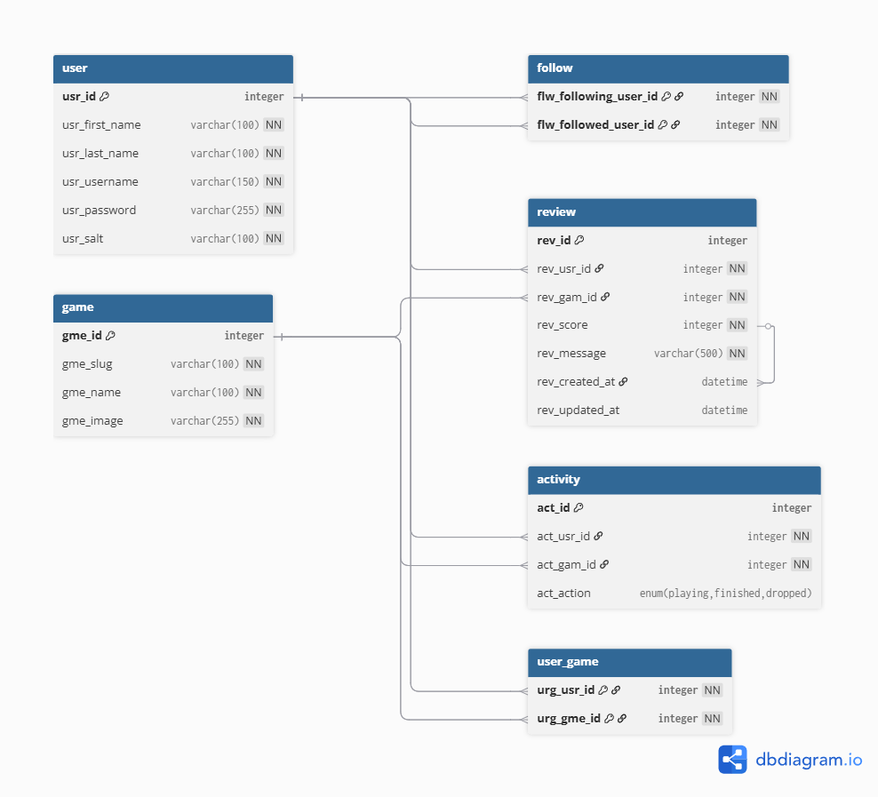

# Final Team Project

## Splitscreen

## Progress Report

### Completed Features

* Profile Features (Review & Activity statistics, Friend Managment, Account Management, Favourite Game Management)
* User Pages (View Reviews & Activities and their statistics, View their Friends, View their favourite games) 
* Friend System (Add, Remove, and view friend's reviews and activities) 
* PWA Functionality (offlice cache, downloadable app, Favicon browser support)
* Search Functionality (search for users & Games)
* Game Pages (Review games, add activities, favourite games)
* Home Page (View Featured Games, Games Coming Soon, And Recently Released Games, and Recent activity if signed in)
* Authentication System (Content can be restricted, some content is avaliable without an account but it is different to that avaliable with)

### Known Issues & Limitations

* External API is slow to respond causing long load times
* External API is no longer being maintained and has occasional outages
* Styling issues for Activities and Reviews on smaller screens)

## Authentication & Authorization

User's are able to access some features like seeing games and statistics but are locked out of creating reviews, activities, favoriting games, and adding friends without an account. User's can create an account from any page that doesn't require authorization. The accounts are stored within the db including an id, username, hashed password, password salt, full name, and any content settings. Users who have an account are able to login by entering their username and password which will provide them with a token to prove auth. There are different versions of some pages one that doesn't require Auth with limited functionality, and one requiring authentication with full functionality. Some Pages only have one version and always require Auth.

## PWA Capabilities
This project supports Progressive Web App behavior by having service workers, a web app manifest, and offline handling. The service worker caches important frontend files like the HTML, JavaScript files, CSS files, images, and the manifest so they can all be loaded with no network connection. The project also uses different caching strategies. Static assets are served from the cache if possible, while some of the API call requests use the network first to try and get fresh data, but still fall back to the cache if not possible. The web app manifest makes the site installable and gives it things like name, theme color, start URL, display mode, and icons.
<!-- Describe features available to your users offline, caching strategy, installability, theming, etc. -->

## API Documentation

Method | Route                                           | Description
------ | ------------------------------------------------| ----------------------- |
`POST`  | `/login`                                       | Receives an username and password & provides user token for authentication
`POST`  | `/logout`                                      | Log out the current user
`POST`  | `/register`                                    | Creates a new user account and returns the new user object
`GET`   | `/users/id/:userId`                            | Retrieve a specific user by id
`GET`   | `/users/current`                               | Retrieves currently logged in user
`GET`   | `/users/name/:username`                        | Search for a user by username
`PUT`   | `/users/update/:username`                      | Update user information
`POST`  | `/reviews/`                                    | Create new review
`PUT`   | `/reviews/:reviewId`                           | Update existing review
`GET`   | `/reviews/user/:userId`                        | Get all reviews posted by a user
`GET`   | `/reviews/specific/:userId/game/:gameId`       | Get a user's reviews for a game
`GET`   | `/reviews/game/:gameId`                        | Get all reviews for a game
`GET`   | `/reviews/all`                                 | Get all reviews
`DELETE`| `/reviews/:reviewId/`                          | Delete specific review
`GET`   | `/activites/:userId/`                          | Get activities by user
`GET`   | `/activites/game/:gameId/:userId/`             | Get status of a specific game for a user
`PUT`   | `/activities/game/:gameId/:userId/`            | update status of a specific game for a user
`DELETE`| `/activities/game/:gameId/:userId/`            | Clear a status for a user on a game
`POST`  | `/friends/:friendId`                           | Add a new friend
`GET`   | `/friends/all`                                 | Get all a user's friends
`GET`   | `/friends/confirm/:friendId`                   | Confirm user's are friends
`DElETE`| `/friends/:friendId`                           | Remove a friend
`GET`   | `/favorite/:userId`                            | Get a user's favorite games
`POST`  | `/favorite/:gameId`                            | Add a favorite game
`DELETE`| `/favorite/:gameId`                            | Remove a favorite game
`GET`   | `/games/featured`                              | Get a featured game from external database
`GET`   | `/games/recent`                                | Get multiple recently released games
`GET`   | `/games/anticpated`                            | Get multiple coming soon games
`GET`   | `/games/id/:gameId`                            | Retrieves a game by its Id
`GET`   | `/games/name/:gameName`                        | Retrieves a game by its Name

## Database ER Diagram

## Team Member Contributions

#### Razvan Braha

* Service Workers
* Web Manifest
* Offline Handling

#### Morgan Sawyer

* User Pages Functionality
* Game Pages Functionality
* Recent Activity Functionality

#### Riley Wickens

* Reworked Authentication
* Search Functionality
* Game Functionality
* Friends Functionality
* Finalised Styling
* Favorite Game Functionality

#### Milestone Effort Contribution

Razvan Braha  | Morgan Sawyer | Riley Wickens
------------- | ------------- | --------------
25%            | 25%            | 50%
