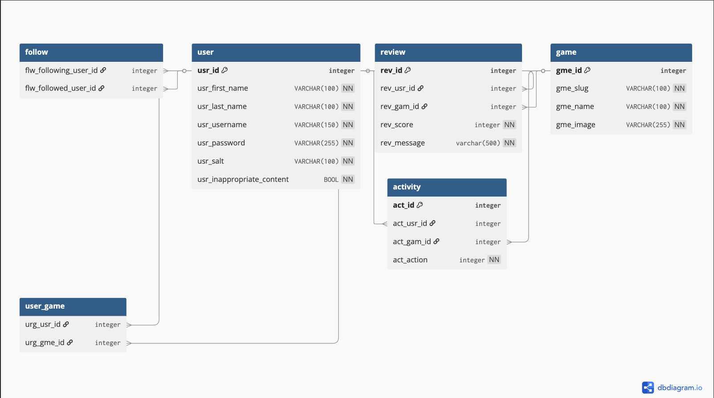

# Team Project: Milestone 2

## Splitscreen

## Progress Report

### Completed Features

* User Authentication
* Database Setup & Interactions with, users, games, reviews, activities, user_games, and friends
* Backend functionality for Users, Games, Reviews, Activities

### Pending Features

* Frontend Game Data Display
* Frontend Friend Functionality 
* Search Functionality
* User Settings & profile data display
* Favorite Games frontend

### Authorization Practices 
User's are able to access some features like seeing games and statistics but are locked out of creating reviews, activities, favoriting games, and adding friends without an account. User's can create an account from any page that doesn't require authorization. The accounts are stored within the db including an id, username, hashed password, password salt, full name, and any content settings. Users who have an account are able to login by entering their username and password which will provide them with a token to prove auth. Auth  is checked in two ways a lax and a strict way depending on the content accessed. Lax will allow user's to continue on the page but with limited content but strict will remove them from the page entirely. 

### Page Implementation Progress

<!-- Provide links to wireframes of pages not 100% completed -->

Page        | Status  | Wireframe
-------     | ------  | ---------
Login       | ✅      | 
Create User | ✅      |
Profile     | 75%     | [wireframe](../Proposal/Wireframes/Splitscreen_Website_Wireframe.png)
Home        | 90%     | [wireframe](../Proposal/Wireframes/Splitscreen_Website_Wireframe.png)
Game        | 75%     | [wireframe](../Proposal/Wireframes/Splitscreen_Website_Wireframe.png)
User        | 75%     | [wireframe](../Proposal/Wireframes/Splitscreen_Website_Wireframe.png)

## API Documentation

Method  | Route                         | Description
------  | ---------------------         | ---------
`POST`  | `/login`                      | Receives an username and password & provides user token for authentication
`POST`  | `/logout`                     | Log out the current user
`POST`  | `/register`                   | Creates a new user account and returns the new user object
`GET`   | `/users`                      | Retrieves an array of all active users in the system
`GET`   | `/users/:userId`              | Retrieves a user by its Id
`GET`   | `/users/current`              | Retrieves currently logged in user
`PUT`   | `/users/update/:userId`       | Update user information
`POST`  | `/reviews/`                   | Create new review
`PUT`   | `/reviews/:reviewId`          | Update existing review
`GET`   | `/reviews/user/:userId`       | Get all reviews posted by a user
`GET`   | `/reviews/game/:gameId`       | Get all reviews for a game
`DELETE`| `/reviews/:reviewId/`         | Delete specific review
`POST`  | `/activities/`                | Create New Activity
`PUT`   | `/activities/:activityId/`    | Update an existing Activity
`GET   `| `/activities/:userId/`        | Get activities by user
`POST`  | `/friends/`                   | Add a new friend
`GET`   | `/friends/:userId`            | Get a user's friends
`DElETE`| `/friends/:userId/:friendId`  | Remove a friend
`GET`   | `/games/featured`             | Get a featured game from external database
`GET`   | `/games/recent`               | Get multiple recently released games
`GET`   | `/games/anticpated`           | Get multiple coming soon games
`GET`   | `/games/id/:gameId`           | Retrieves a game by its Id
`GET`   | `/games/name/:gameName`       | Retrieves a game by its Name

## Database ER Diagram

## Team Member Contributions

#### Razvan Braha

* Database Setup
* User Authentication

#### Morgan Sawyer

* Review Backend
* Activity Backend

#### Riley Wickens

* User Authentication
* Game Backend & Frontend
* User Functionality Backend

#### Milestone Effort Contribution

<!-- Must add to 100% -->

Razvan Braha  | Morgan Sawyer | Riley Wickens
------------- | ------------- | --------------
33.3%         | 33.3%         | 33.3%
