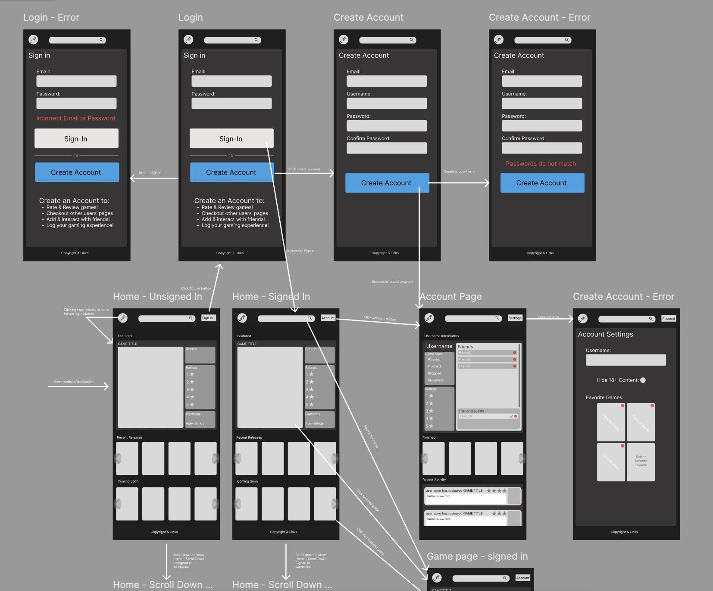
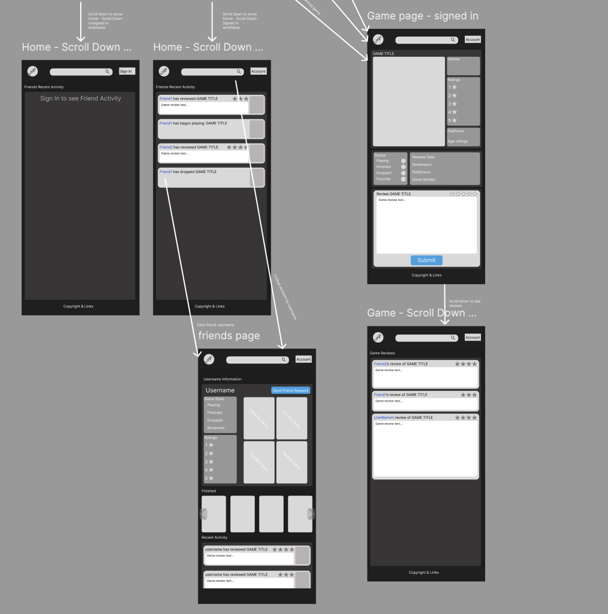
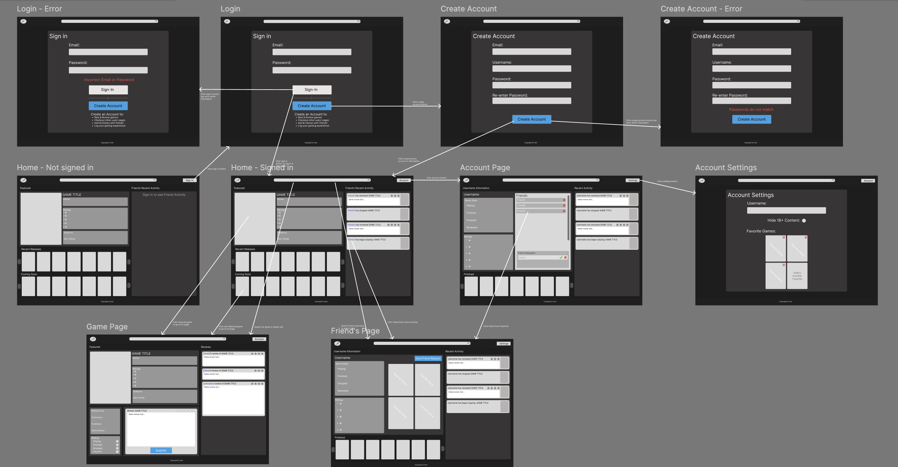

# [Splitscreen]

## Problem Statement

*[The problem or need that your proposed PWA addresses. Who are the target users, and why would they want to use your app?]*

When looking at video game platforms, people love to congregate their and share acheivements, reviews, and general community thoughts and feelings. That's why for Playstation, Xbox, and Steam have they have their own systems that fulfill this desire. However, because these platforms are siloed off from one another, people who play on multiple platforms don't have a central place to discuss games and show off their achievemnts. Additionally, some older platforms don't have these social hubs anymore, so users must look for other websites that don't feel connected to have these discussions.

## Feature Description

*[The general features your application provides. What are the things users will be able to accomplish with your app?]*

### PWA Capabilities

*[How do you plan to take advantage of PWA capabilities? What are the main features of your app that will be enhanced by being a PWA?]*

Our application is a perfect fit for a progressive web application because we are trying to build a social media application that users have expectations that loads content quickly and is inituitive to all users. That's why having our application as a installiable app that allows for content to load faster is a must have for the user experience. For example, for our platform to be successful users will have to want to comunicate with other users seamlessly and be a part of a community. If our platform causes users to fight with it to load the content their looking for, then they will naturally migrate to other platforms that facilitate community interations better, even if our platform offers more content. Another feature that is a must have is allowing users to use the application offline. Sometimes users will want to log their own reviews for video games offline and then will want their reviews to be uploaded when they get back online. Or users will want to review their past video game reivews to compare it to the current game their playing. Without this feature, users will feel a friction that they always need to be online which we can not have.

## Wireframes

### Mobile Views

Figma Link: https://www.figma.com/design/uPYV69kbb4RVqpyomXhSlL/Splitscreen-Wireframes?node-id=0-1&p=f&t=V4FG0s3l0ho9oN0G-0 

### Desktop Views

Figma Link: https://www.figma.com/design/2jU7hkhojJmDua7A6JK25W/Splitscreen-Web-Wireframe?node-id=0-1&m=dev&t=DDDlYHxz6stKJogG-1

## Sources of Data Needed

*[What data do you need for this to work, and how will you get it? For example, External APIs, web scraping, public datasets, etc.]*

## Team Member Contributions

#### [Name of Team Member 1]

* Contribution 1
* Contribution 2
* ...

#### Morgan Sawyer

* Problem Statement
* PWA Capabilities
* Reviewed Wireframes

#### Riley Wickens

* Website Wireframes
* Mobile Wireframes
  
#### Milestone Effort Contribution

<!-- Must add to 100% -->

Team Member 1 | Morgan Sawyer | Riley Wickens
------------- | ------------- | --------------
33.33%            | 33.33%            | 33.33%
